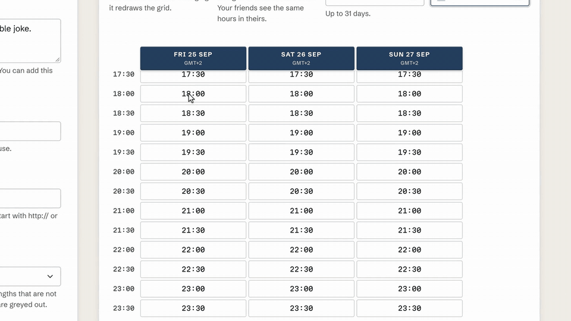
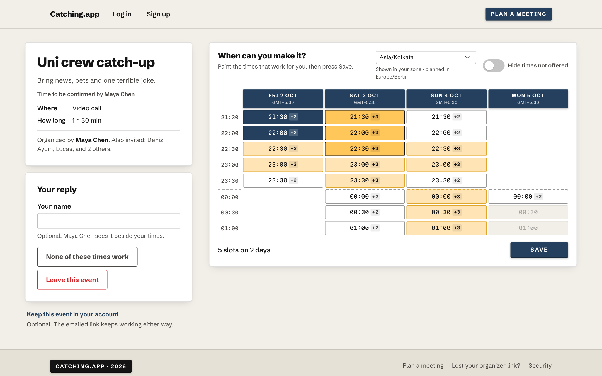
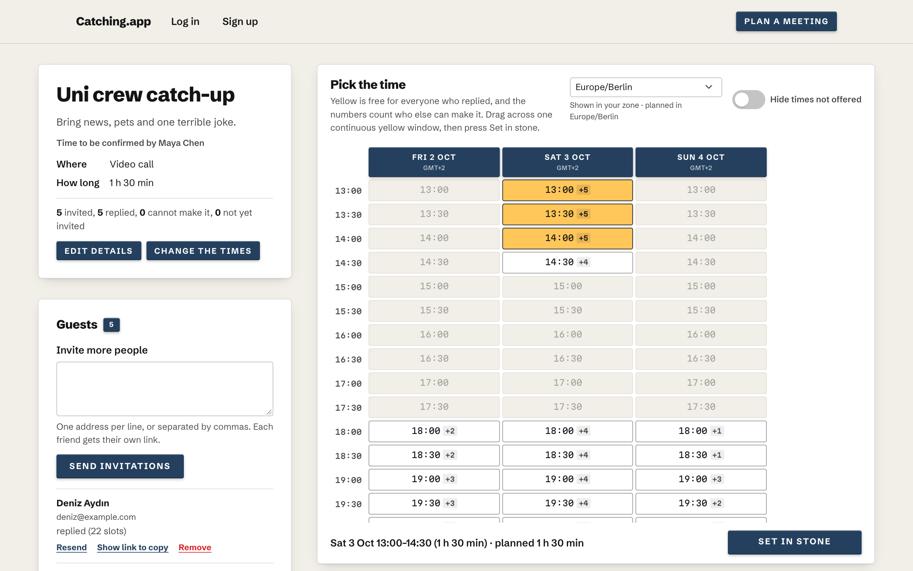
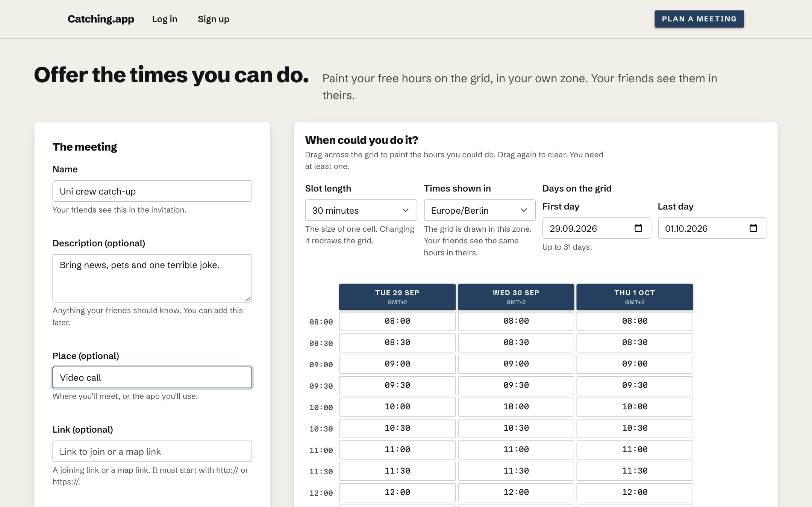
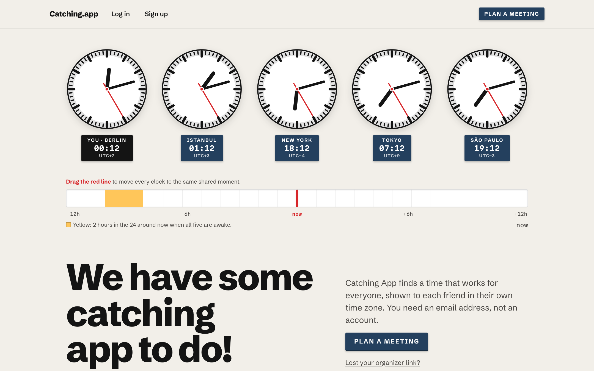
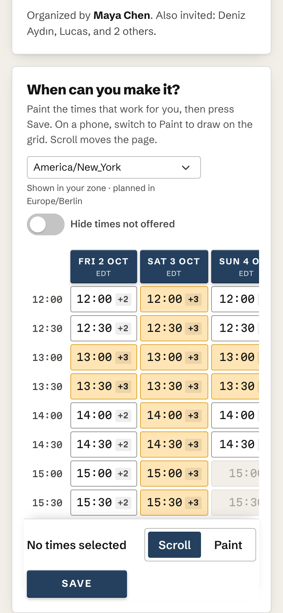
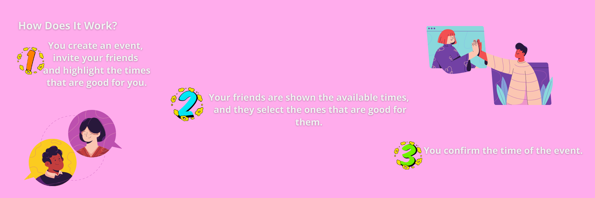

# Catching App

Catching App finds a time that works for a group of friends in different time zones. The organizer paints the hours they can offer on a grid; each friend opens a personal link, sees the same hours in their own zone, and paints back the ones that suit them. The organizer then sets one window that everyone shares, and every participant is emailed the time in their own zone with a calendar file. Nobody has to sign up.

<p align="center"></p>

| A guest in Bengaluru answers an offer made in Berlin | The organizer picks the window everyone shares |
|---|---|
|  |  |
| **Planning a meeting** | **The landing page** |
|  |  |

<p align="center"></p>

On a phone, a finger scrolls the page by default and paints only after the guest switches to Paint, so nothing is painted by accident.

## Stack

- Ruby 4.0.5 (the Gemfile accepts `~> 4.0.5`) and Rails 8.1.3.1
- PostgreSQL 17 or 18
- Node.js 24.18.0 LTS and npm 11.16.0
- Propshaft, esbuild, Dart Sass, Turbo, Stimulus, Bootstrap 5, and Luxon
- Rails' built-in authentication for optional accounts; capability links for everyone else
- Minitest, RuboCop Rails Omakase, Brakeman, and bundler-audit

Runtime versions are pinned in `.ruby-version`, `.node-version`, `Gemfile.lock`, and `package-lock.json`. Dependency updates are applied by hand; `bin/bundler-audit` and `npm audit` run in CI.

## Local setup

Install the pinned Ruby and Node.js versions, PostgreSQL, and Chrome or Chromium for system tests. Then run:

```bash
cp .env.example .env
bin/setup --skip-server
bin/dev
```

The app is available at <http://localhost:3000>. On a newly created development database, setup loads three demo users. Their shared password defaults to `development-password` and can be changed with `SEED_PASSWORD` before running setup.

To rebuild the database and development seed data:

```bash
bin/setup --reset --skip-server
```

## Verification

Run the complete local gate:

```bash
bin/ci
```

The gate installs deterministic dependencies, lints Ruby, audits Ruby and JavaScript dependencies, runs Brakeman, checks eager loading, builds assets and runs the JavaScript tests, then runs the Rails and system test suites. Individual commands are also available:

```bash
bin/rails test
bin/rails test:system
bin/rails zeitwerk:check
bin/rubocop
bin/brakeman --quiet --no-pager --exit-on-warn --exit-on-error
bin/bundler-audit check --update
npm run check
npm audit --audit-level=high
```

GitHub Actions runs the same categories of checks with PostgreSQL 18 and also builds the production image.

## Production container

Build the non-root production image:

```bash
docker build -t catching-app .
```

The runtime expects these environment variables:

- `APP_HOST`: public hostname, without a scheme
- `DATABASE_URL`: PostgreSQL connection URL
- `SECRET_KEY_BASE` or `RAILS_MASTER_KEY`: Rails signing secret
- `MAILER_FROM`: sender address
- `SMTP_ADDRESS`: SMTP server address
- `SMTP_PORT`, `SMTP_USERNAME`, and `SMTP_PASSWORD`: optional SMTP connection settings
- `INVITATION_DAILY_BUDGET`: optional ceiling on invitation mails per day (default 500)
- `LOG_REQUESTS`: set to `false` (the Dockerfile does) so Thruster does not log capability links
- `SOLID_QUEUE_IN_PUMA`: set (the Dockerfile does) to run the job worker inside Puma; `JOB_CONCURRENCY` sets its processes (default 1)

The container prepares the database before starting, listens through Thruster on port 80, and exposes `GET /up` as its health endpoint. Mail is sent by Solid Queue jobs that wait in the same database, so queued mail survives a restart. It assumes TLS is terminated by the reverse proxy and forces HTTPS for application traffic.

## Deployment

The app runs on one Hetzner server, deployed with [Kamal](https://kamal-deploy.org) from `config/deploy.yml`. Kamal builds the image from the `Dockerfile`, starts it behind kamal-proxy (which obtains the Let's Encrypt certificates for `catching.app` and `www.catching.app`), and runs PostgreSQL 17 as an accessory on the same server. The job worker runs inside Puma, so there is no separate worker container.

Secrets are read at deploy time by `.kamal/secrets` from files in `~/.config/catching-app/` on the deploying machine (`secret_key_base`, `postgres_password`, and `resend_api_key`); no secret is stored in the repository.

```bash
bin/kamal deploy        # build, push and switch to the new version
bin/kamal logs          # follow the app's logs
bin/kamal console       # a Rails console on the server
```

Mail goes out through [Resend](https://resend.com)'s SMTP server. The sending domain `catching.app` is verified there with the DKIM and return-path records Resend lists, and the API key is the SMTP password.

## How scheduling works

An organizer plans an event with an email address, a name, a slot length (15, 30 or 60 minutes), a time zone and a painted set of offered times. The organizer receives a link by email; opening it proves the address, and only then can invitations be sent. Each guest receives their own link, paints availability on the organizer's grid (mouse, finger or keyboard), can say that none of the times work, or can leave the event. The organizer finalizes one continuous window that every responder shares. Accounts are optional: they remember the events they take part in on a dashboard, and a guest can keep an event in an account from their link.

## Security model

- Every person on an event is a participant row; links carry a 32-character random token that is stored only as a SHA-256 digest. Re-sent and recovered links are pending tokens that go live on their first use, so a working link is never revoked by a resend, a scanner, or a stranger who knows the organizer's address.
- Nothing is sent to guests before the organizer has opened the emailed link. Invitations are capped per organizer, per recipient, per event and address, per IP, and by a global daily budget (`INVITATION_DAILY_BUDGET`, default 500), all counted in a delivery ledger. Confirmations and finalized notices are never refused.
- There is no member directory. Guests see the names other guests chose to give, and a count of the rest; the organizer sees the addresses they invited.
- Scheduling writes run under the event's row lock; database constraints enforce one organizer per event, one address per event, one account per event, quarter-hour instants and whole-slot windows.
- Capability pages are `no-store` and `noindex`, tokens are masked in request and redirect logs, and Thruster request logging is off in the production image.
- Authentication endpoints and token-route writes are rate limited per container as a courtesy layer; production forces TLS and host authorization.

See the official [Ruby releases](https://www.ruby-lang.org/en/downloads/releases/) and [Rails maintenance policy](https://guides.rubyonrails.org/maintenance_policy.html) for the support status behind the pinned baseline.

## History

The original 2021 application was a three-person Le Wagon project built with [Sedef Çakmak](https://github.com/sedcakmak) and [Ege Çakmak](https://github.com/Egecak). GitHub attributes substantial implementation work to Okan, including 11 merged pull requests and 47 of the newest 100 commits at the 2026-07-18 audit. [Okan's merged pull-request history](https://github.com/okturan/catching-app/pulls?q=is%3Apr+is%3Amerged+author%3Aokturan) is the durable attribution source; the project is not presented as solo work, and no project-wide license is asserted without all three authors' agreement.

### The 2021 interface

The original team screenshots record the 2021 product flow.

| Landing page | Event scheduling |
|---|---|
|  |  |

The complete historical set is in [`docs/screenshots/legacy`](docs/screenshots/legacy).
